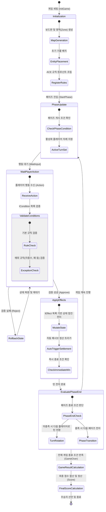
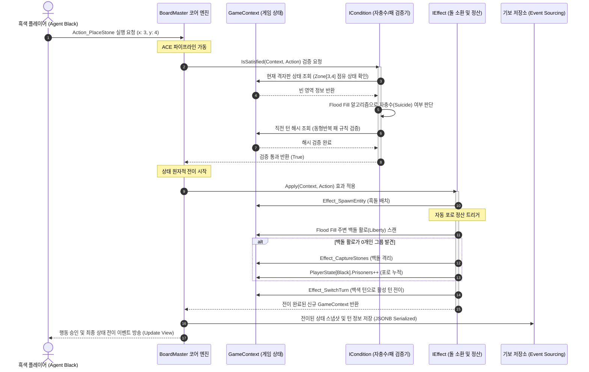

# [설계서] BoardMaster 온톨로지 엔진 동적 흐름 설계
**Ontology-Driven Board Game AI Engine - Dynamic Flow Design (v1.0)**

본 문서는 보드게임 AI 룰 엔진 플랫폼 **'BoardMaster'**의 런타임 제어 흐름과 객체 간의 동적 상호작용을 정의한 **동적 흐름 설계서(Dynamic Flow Design)**입니다. 

정적 구조 설계서에서 정의된 온톨로지 지식 노드들(`GameContext`, `Zone`, `Entity`, `PlayerState`)과 규칙 조립 컴포넌트들(`Action`, `ICondition`, `IEffect`)이 실제 게임 실행 시점에서 어떻게 유기적으로 동작하며, 게임 준비부터 최종 점수 정산 및 승리 판정까지의 생명 주기(Lifecycle)를 통제하는지 구체적으로 명세합니다.

---

## 🗺️ 1. 동적 흐름 설계 사상 (Design Philosophy)

인간이 보드게임을 배우고 설명하는 7단계 인지 모델 중 **흐름(Flow), 행동(Action), 시연(Simulation), 정산(Settlement)** 단계의 논리적 연속성을 소프트웨어의 동적 런타임 루프로 기계화하기 위해 다음과 같은 아키텍처적 규칙을 수립합니다:

1. **상태 불변성과 원자적 전이 (State Immutability & Atomic Transition):** 
   * 플레이어의 행동(`Action`)은 상태 검증(`ICondition`)을 완벽히 통과하기 전까지 실제 게임 상태를 절대 오염시키지 않습니다.
   * 상태 전이 효과(`IEffect`)들은 순차적으로 실행되나, 예외가 발생하거나 유효하지 않은 결과가 초래될 시 전체 행동 체인이 롤백(Rollback)되어 이전 상태를 완벽히 유지합니다.
2. **선행 룰 목차 기반의 페이즈 머신 (Phase State Machine):**
   * 보드판의 세부 기물 처리를 수행하기 전에, 게임의 전체적인 흐름 단계(예: 라운드 시작 ➡️ 행동 단계 ➡️ 라운드 종료 정산 ➡️ 정리 단계)를 독립된 페이즈 상태 객체로 분리하여 거시적 제어 흐름을 명확하게 파악할 수 있도록 합니다.
3. **사용자 행동과 자동 정산의 완전한 분리:**
   * 플레이어가 직접 선언하는 의지적 행동(`Action_Play`)과, 그 행동의 파생 결과로 인해 룰 엔진이 자동적으로 처리해야 하는 규칙(예: 바둑의 죽은 돌 따내기, 패 유무 검증, 라운드 종료 세금 징수 등)을 패시브 트리거 시스템을 통해 구조적으로 분리합니다.

---

## 🎨 2. 동적 흐름 시각화 (Mermaid Diagrams)

### 2.1 메인 게임 루프 상태 전이도 (State Transition Diagram)
게임의 준비 단계부터 라운드 순환, 플레이어 차례 대기, 규칙 검증, 자동 정산 및 승리 판정 후 종료에 이르는 전반적인 수명 주기를 나타냅니다.



### 2.2 바둑 착수 및 포로 자동 정산 시퀀스 다이어그램 (Sequence Diagram)
플레이어가 특정 좌표에 돌을 놓았을 때, 엔진 내부적으로 예외 규칙(자충수/패)을 필터링하고 죽은 돌을 탐색하여 포로로 획득한 뒤 다음 턴으로 전환하는 세부 상호작용입니다.



---

## 🛠️ 3. 플랫폼 코어 룰 엔진 동적 C# 시뮬레이터 설계

본 명세는 AntiGravity C# 헝가리안 및 파스칼 표기법 가이드를 엄격하게 준수하여 작성된 **동적 상태 제어기(Phase Manager & Action Dispatcher)의 코어 코드**입니다.

```csharp
using System;
using System.Collections.Generic;

namespace BoardMaster.Core.Ontology.Dynamic
{
    // ==========================================
    // 1. 공통 런타임 예외 클래스
    // ==========================================
    public class RuleViolationException : Exception
    {
        public RuleViolationException(string p_strMessage) : base(p_strMessage) { }
    }

    // ==========================================
    // 2. 동적 흐름 제어를 위한 페이즈 인터페이스
    // ==========================================
    public interface IGamePhase
    {
        string mv_strPhaseName { get; }
        void OnPhaseEnter(GameContext p_objContext);
        void OnPhaseUpdate(GameContext p_objContext);
        void OnPhaseExit(GameContext p_objContext);
        bool IsPhaseCompleted(GameContext p_objContext);
    }

    // ==========================================
    // 3. 동적 액션 디스패처 및 런타임 엔진 구현
    // ==========================================
    public class ActionDispatcher
    {
        /// <summary>
        /// 플레이어로부터 행동을 접수하여 검증하고, 성공 시 전역 컨텍스트 상태를 원자적으로 전이시킵니다.
        /// </summary>
        public GameContext Dispatch(GameContext p_objContext, Action p_objAction)
        {
            if (p_objContext.mv_isGameOver)
            {
                throw new RuleViolationException("이미 종료된 대국입니다. 추가적인 행동을 취할 수 없습니다.");
            }

            // 1. 사전 조건 검증 (Condition Verification)
            foreach (var cond in p_objAction.mv_lisConditions)
            {
                if (!cond.IsSatisfied(p_objContext, p_objAction))
                {
                    throw new RuleViolationException($"행동 규칙을 위반했습니다. 검증 실패 규칙: {cond.GetType().Name}");
                }
            }

            // 2. 상태 가상 복제본 준비 (Deep Copy / Rollback Buffer)
            // AI 시뮬레이션 및 예외 시 롤백을 보장하기 위해 현재 전역 상태 복제
            GameContext objTempContext = CloneGameContext(p_objContext);

            try
            {
                // 3. 상태 전이 연쇄 적용 (Sequential State Transitions)
                foreach (var effect in p_objAction.mv_lisEffects)
                {
                    objTempContext = effect.Apply(objTempContext, p_objAction);
                }

                // 4. 이력 및 보드 상태 갱신
                objTempContext.mv_lisHistory.Add(p_objAction.mv_stActionData);
                UpdateBoardStateHash(objTempContext);

                return objTempContext;
            }
            catch (Exception ex)
            {
                // 예외 발생 시 전이 상태를 무효화하고 원본 컨텍스트 반환 (Atomic Rollback)
                Console.WriteLine($"[Engine ERROR] 상태 전이 연쇄 도중 오류 발생: {ex.Message}. 롤백을 수행합니다.");
                throw;
            }
        }

        private GameContext CloneGameContext(GameContext p_objSource)
        {
            GameContext objClone = new GameContext
            {
                mv_isGameOver = p_objSource.mv_isGameOver,
                mv_stCurrentState = new ST_BoardState
                {
                    m_nTurnNumber = p_objSource.mv_stCurrentState.m_nTurnNumber,
                    m_eActiveColor = p_objSource.mv_stCurrentState.m_eActiveColor,
                    m_nBlackPrisoners = p_objSource.mv_stCurrentState.m_nBlackPrisoners,
                    m_nWhitePrisoners = p_objSource.mv_stCurrentState.m_nWhitePrisoners,
                    m_a_nBoardGrid = (int[,])p_objSource.mv_stCurrentState.m_a_nBoardGrid.Clone()
                },
                mv_lisHistory = new List<ST_ActionData>(p_objSource.mv_lisHistory)
            };

            // 플레이어 정보 깊은 복사
            foreach (var player in p_objSource.mv_lisPlayers)
            {
                objClone.mv_lisPlayers.Add(new PlayerState
                {
                    mv_strPlayerID = player.mv_strPlayerID,
                    mv_eColor = player.mv_eColor,
                    mv_nPrisonerCount = player.mv_nPrisonerCount,
                    mv_nScore = player.mv_nScore
                });
            }

            // 영역 정보 복사
            foreach (var kvp in p_objSource.mv_dicZones)
            {
                objClone.mv_dicZones.Add(kvp.Key, new Zone
                {
                    mv_strZoneID = kvp.Value.mv_strZoneID,
                    mv_nX = kvp.Value.mv_nX,
                    mv_nY = kvp.Value.mv_nY,
                    mv_eVisibility = kvp.Value.mv_eVisibility,
                    mv_lisAdjacentZoneIDs = new List<string>(kvp.Value.mv_lisAdjacentZoneIDs)
                });
            }

            return objClone;
        }

        private void UpdateBoardStateHash(GameContext p_objContext)
        {
            // 이력 및 격자 판 정보를 활용해 동형반복 패 규칙 검사 등에 쓰일 현재 시점 고유 해시 식별자 생성 알고리즘 배치
        }
    }

    // ==========================================
    // 4. 바둑 자충수 및 캡처 자동 처리 조건체 예시 (FR-3.2.1)
    // ==========================================
    public class Cond_NotSuicide : ICondition
    {
        public bool IsSatisfied(GameContext p_objContext, Action p_objAction)
        {
            int nX = p_objAction.mv_stActionData.m_nX;
            int nY = p_objAction.mv_stActionData.m_nY;
            E_PlayerColor eColor = p_objAction.mv_stActionData.m_eColor;

            // 가상 대입 후 활로 스캔 시뮬레이션
            int[,] a_nGrid = (int[,])p_objContext.mv_stCurrentState.m_a_nBoardGrid.Clone();
            a_nGrid[nX, nY] = (int)eColor;

            // 1. 내가 돌을 둠으로써 아군 그룹의 활로가 1개 이상 확보되는가?
            int nMyLiberties = CalculateLiberties(a_nGrid, nX, nY, eColor);
            if (nMyLiberties > 0) return true;

            // 2. 만약 내 활로가 0개라면, 내 착수로 인해 인접한 상대편 돌을 숨막히게 하여 따낼 수 있는가?
            E_PlayerColor eOpponentColor = (eColor == E_PlayerColor.Black) ? E_PlayerColor.White : E_PlayerColor.Black;
            List<Tuple<int, int>> lisNeighbors = GetAdjacentCoords(nX, nY, a_nGrid.GetLength(0));

            foreach (var neighbor in lisNeighbors)
            {
                if (a_nGrid[neighbor.Item1, neighbor.Item2] == (int)eOpponentColor)
                {
                    if (CalculateLiberties(a_nGrid, neighbor.Item1, neighbor.Item2, eOpponentColor) == 0)
                    {
                        // 상대방을 따낼 수 있으므로 자충수 예외에서 제외 (적법한 착수)
                        return true;
                    }
                }
            }

            return false; // 활로도 없고 상대방을 따낼 수도 없으므로 자충수(Suicide) 규칙 위반
        }

        private int CalculateLiberties(int[,] p_a_nGrid, int p_nX, int p_nY, E_PlayerColor p_eColor)
        {
            // Flood Fill(BFS)을 통한 해당 색상 돌 그룹의 공통 활로(0인 칸) 개수 계산 알고리즘 배치
            int nSize = p_a_nGrid.GetLength(0);
            bool[,] a_bVisited = new bool[nSize, nSize];
            Queue<Tuple<int, int>> queue = new Queue<Tuple<int, int>>();
            HashSet<Tuple<int, int>> setLiberties = new HashSet<Tuple<int, int>>();

            queue.Enqueue(new Tuple<int, int>(p_nX, p_nY));
            a_bVisited[p_nX, p_nY] = true;

            while (queue.Count > 0)
            {
                var current = queue.Dequeue();
                List<Tuple<int, int>> lisNeighbors = GetAdjacentCoords(current.Item1, current.Item2, nSize);

                foreach (var neighbor in lisNeighbors)
                {
                    int nVal = p_a_nGrid[neighbor.Item1, neighbor.Item2];
                    if (nVal == 0)
                    {
                        setLiberties.Add(neighbor); // 공통 활로 누적
                    }
                    else if (nVal == (int)p_eColor && !a_bVisited[neighbor.Item1, neighbor.Item2])
                    {
                        a_bVisited[neighbor.Item1, neighbor.Item2] = true;
                        queue.Enqueue(neighbor);
                    }
                }
            }
            return setLiberties.Count;
        }

        private List<Tuple<int, int>> GetAdjacentCoords(int p_nX, int p_nY, int p_nLimit)
        {
            List<Tuple<int, int>> lisCoords = new List<Tuple<int, int>>();
            if (p_nX > 0) lisCoords.Add(new Tuple<int, int>(p_nX - 1, p_nY));
            if (p_nX < p_nLimit - 1) lisCoords.Add(new Tuple<int, int>(p_nX + 1, p_nY));
            if (p_nY > 0) lisCoords.Add(new Tuple<int, int>(p_nX, p_nY - 1));
            if (p_nY < p_nLimit - 1) lisCoords.Add(new Tuple<int, int>(p_nX, p_nY + 1));
            return lisCoords;
        }
    }
}
```

---

## 🌟 4. 동적 흐름 설계가 가져오는 아키텍처적 강점

1. **완벽한 불변성 시뮬레이션 (MCTS 롤아웃 극대화):**
   * AI 에이전트가 최적의 수 찾기를 위해 미래의 수십 수 앞을 가상으로 두어보는 '가상 복제 롤아웃(Rollout)' 시, 힙(Heap) 오염 및 참조 정합성 뒤틀림이 일어날 걱정 없이 `ActionDispatcher`의 원자적 복제 메커니즘을 통해 완벽히 고속 고립 연산이 이루어집니다.
2. **이벤트 소싱 기보 복기 완벽성:**
   * 모든 런타임 상태 변경 전이가 `Action` 객체와 일련의 수식 데이터(`ST_ActionData`)로 완전히 기록 및 직렬화되어 DB에 들어가기 때문에, 경기 진행 도중 특정 시점으로 기보를 복기(Time Travel / Undo)하거나 버그 발생 국면을 정밀하게 다시 재생(Replay)하는 개발 및 추적 도구를 무비용으로 구축할 수 있습니다.
3. **가변 오버라이딩을 통한 룰 무한 확장성:**
   * 새로운 보드판 영역이나 특수한 룰 변환(예: '겨울철 이동력 감쇄', '자석 쳐내기 반사 반경 예외' 등) 추가 시 코어 파이프라인의 분기 로직을 하나도 손대지 않고, `ICondition`과 `IEffect` 조립 정보만을 교체 주입함으로써 유연하고 견고한 플랫폼 유지보수가 완성됩니다.
