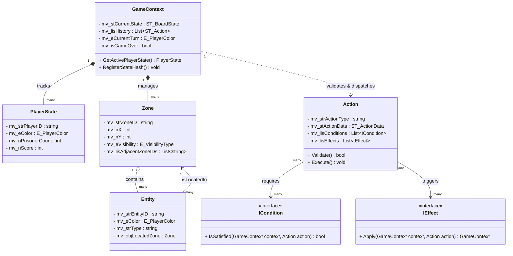
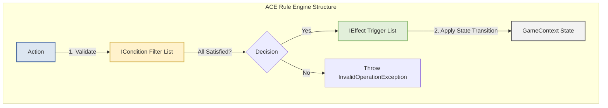
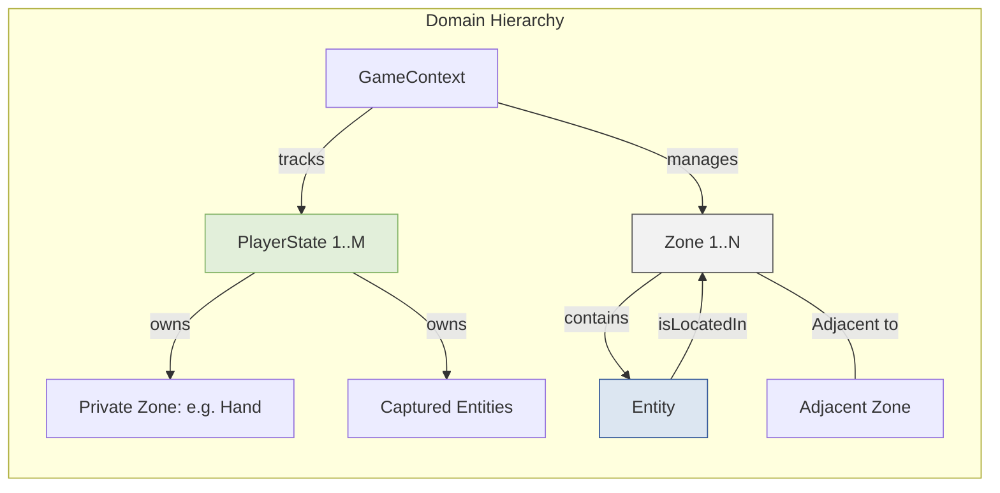

# [설계서] BoardMaster 온톨로지 엔진 정적 구조 설계
**Ontology-Driven Board Game AI Engine - Static Structure Design (v2.1)**

본 문서는 보드게임 AI 룰 엔진 플랫폼 **'BoardMaster'**의 핵심 데이터 구조 및 관계망을 정의한 **정적 구조 설계서(Static Structure Design)**입니다. 

특정 하드웨어 및 운영체제에 종속되지 않는 소프트웨어 공학적 설계 사상을 준수하며, 온톨로지의 **지식 그래프 구조(클래스, 관계, 속성)**를 객체 지향 및 데이터 주도 설계(Data-Driven Design) 개념에 맞추어 도메인 모델로 구체화했습니다. 

이번 **v2.1 업데이트**에서는 범용 룰 엔진 플랫폼과 딥러닝 AI 신경망(정책망/가치망) 간의 매끄러운 바인딩을 위한 **'AI 텐서 정규화 어댑터(AI Tensor Normalization Adapter)'** 설계 요구사항과 인터페이스 명세를 추가로 반영했습니다.

---

## 🗺️ 1. 정적 구조 설계 설계 사상 (Design Philosophy)

본 엔진의 정적 구조는 **"규칙과 상태를 완벽히 데이터로 분리하여 플랫폼을 독립적으로 구동한다"**는 철학을 따릅니다.
이를 실현하기 위해 다음과 같은 설계 원칙을 적용합니다:

1. **지식 그래프화(Graph Representation):** 보드게임판의 형상(Zone)과 기물(Entity)들의 배치는 네트워크 인접 행렬 형태의 그래프 구조로 묘사되어 AI가 직관적으로 탐색 및 수 읽기를 수행할 수 있어야 합니다.
2. **조립식 ACE 엔진 구조:** 규칙 검증 로직(`Condition`)과 상태 변경 로직(`Effect`)이 행동(`Action`) 클래스와 결합되지 않고 독립적인 개체로 존재하며, 실행 시점에 동적으로 의존성이 주입(DI)되는 조립식 다형성 설계를 취합니다.
3. **불변 상태 객체(Immutable State):** 상태 시뮬레이션 및 롤아웃 예측 시 원본 데이터의 오염을 방지하기 위해, 모든 상태 스냅샷 클래스는 불변성을 지향하며 가볍고 빠른 가상 복제(Deep Copy)를 보장해야 합니다.
4. **시점 상대화 및 정보 마스킹 (AI-Ready):** AI 가중치 모델의 범용적 재사용성과 학습 무결성을 보장하기 위해, 온톨로지 상태 데이터를 에이전트의 시점에 맞춰 가변 마스킹하고 정형화된 다차원 수치 데이터로 신속히 주입하는 어댑터 아키텍처를 추구합니다.

---

## 🎨 2. 온톨로지 다차원 관계 시각화 (Mermaid Diagrams)

보드마스터 엔진의 정적 구조와 흐름을 직관적으로 이해할 수 있도록 **4가지 차원의 Mermaid 다이어그램**을 제공합니다.

### 2.1 코어 클래스 관계 다이어그램 (Class Diagram)
**4대 도메인 구성 클래스**(`GameContext`, `PlayerState`, `Zone`, `Entity`)와 **규칙 처리 삼총사**(`Action`, `Condition`, `Effect`)가 맺는 동적인 참조와 소유 관계의 지식 맵입니다.



### 2.2 ACE (Action-Condition-Effect) 규칙 조립식 파이프라인
행동(`Action`)이 규칙 검증 필터(`ICondition`)들의 다중 허가를 통과한 후, 상태 변형기(`IEffect`)들을 트리거하여 `GameContext`에 어떻게 안전하게 반영되는지 묘사하는 정적 컴포넌트 흐름도입니다.



### 2.3 온톨로지 핵심 엔티티 공간 점유 및 소유 구도 (Entity-Zone Layout)
보드게임 기물(`Entity`)과 논리적/물리적 공간(`Zone`), 플레이어(`PlayerState`) 간의 계층적 소유 구조와 그래프 인접망 구조를 시각화한 설계도입니다.



### 2.4 AI 텐서 정규화 파이프라인 (Tensor Normalization Flow)
온톨로지 그래프 상태가 관측 플레이어(AI 에이전트)의 시점에 맞추어 다중 채널 수치 텐서 피처 맵으로 필터링 및 변환되는 아키텍처 흐름입니다.

```mermaid
graph TD
    subgraph Tensor Extraction Process
        GT[GameContext: Ground Truth] -->|Observer ID: Player_A| Adapter[ITensorNormalizationAdapter]
        Adapter -->|1. Perspective Alignment| ObsProj[Observer-Centric Projection]
        Adapter -->|2. Zero-Allocation Mapping| FloatBuffer[float[] Pre-allocated Buffer]
        
        ObsProj -->|Channel 0| Ch0[Ch 0: Active Player's Entities]
        ObsProj -->|Channel 1| Ch1[Ch 1: Opponent's Public Entities]
        ObsProj -->|Channel 2| Ch2[Ch 2: Legal/Empty Space Map]
        ObsProj -->|Channel 3| Ch3[Ch 3: Constraints Map e.g. Suicide/Ko]
        ObsProj -->|Channel 4| Ch4[Ch 4: Masked Hidden Zones]
        
        Ch0 & Ch1 & Ch2 & Ch3 & Ch4 -->|Stacked Tensor| OutputTensor[Formatted float[] 3D Array Input]
        OutputTensor -->|Inference| NeuralNet[AI Neural Network Policy/Value Net]
    end
    style GT fill:#f2f2f2,stroke:#595959,stroke-width:2px;
    style Adapter fill:#dce6f1,stroke:#2f5496,stroke-width:2px;
    style OutputTensor fill:#e2efda,stroke:#82b366,stroke-width:2px;
    style NeuralNet fill:#fff2cc,stroke:#d6b656,stroke-width:2px;
```

---

## 🔍 3. 온톨로지 관계 및 속성 세부 명세 (Ontology Specification)

### 3.1 객체 간의 관계 (Object Properties)
* **`tracks` (참조 소유 관계):** 
  * `GameContext` ➔ `PlayerState`, `Zone`
  * 엔진 매니저는 현재 대국에 참여하는 모든 플레이어의 상태 정보와 보드 공간 구조를 완전히 실시간으로 추적 및 소유합니다.
* **`isLocatedIn` (공간 점유 관계):**
  * `Entity` ➔ `Zone`
  * 바둑돌, 말 등의 기물 객체(`Entity`)는 오직 하나의 유효한 보드 좌표 영역(`Zone`)에 바인딩됩니다.
* **`requires` (검증 의존 관계):**
  * `Action` ➔ `ICondition`
  * 플레이어가 선언한 모든 유효 행동(`Action`)은 상태 변경을 위임하기 전, 자신에게 할당된 여러 검증 조건들(`ICondition`)을 선결 조건으로 요구합니다.
* **`triggers` (상태 전이 관계):**
  * `Action` ➔ `IEffect`
  * 검증을 무사히 통과한 행동은 게임 보드와 플레이어 컨텍스트 정보를 실질적으로 변환시키는 다중 상태 전이 효과들(`IEffect`)을 연쇄적으로 트리거합니다.

### 3.2 고유 데이터 속성 (Datatype Properties)
엄격한 소프트웨어 공학 설계 기준과 가시성 통제 규칙을 적용한 속성 타입 정의입니다:
* **`Zone` 속성:**
  * `mv_nX`, `mv_nY` (Integer): 공간 상의 가시 격자 혹은 네트워크 노드 인덱스 좌표입니다.
  * `mv_eVisibility` (Enum: `Public`/`Private`/`Hidden`): 향후 마피아, 카드 게임 등 정보 비대칭성을 활용하는 불완전 정보 보드게임 장르로 확장 시 정보를 안전하게 필터링 및 마스킹하기 위한 통제 레벨 속성입니다.
* **`Entity` 속성:**
  * `mv_eColor` (Enum): 검정(`Black`), 하양(`White`), 혹은 무색(`None`) 등의 물리적 소유자 진영 색상입니다.
* **`PlayerState` 속성:**
  * `mv_nPrisonerCount` (Integer): 바둑 등의 규칙에서 상대방 돌을 따내어 확보한 포로의 적립 수량입니다.
* **`Action` 속성:**
  * `mv_isPass` (Boolean): 턴 진행을 무위로 돌리고 상대에게 넘기는 패스 행동 여부 플래그입니다.

---

## 🛠️ 4. 플랫폼 코어 룰 엔진 정적 C# 추상화 및 뼈대 설계

가독성 및 유지보수성이 검증된 헝가리안 표기법 및 파스칼 표기법 가이드를 엄밀히 적용한 핵심 정적 클래스 및 인터페이스 구조체 뼈대 코드입니다:

```csharp
using System;
using System.Collections.Generic;

namespace BoardMaster.Core.Ontology
{
    // ==========================================
    // 1. 공통 열거형 및 시스템 구조체 정의
    // ==========================================
    
    public enum E_PlayerColor
    {
        None = 0,
        Black = 1,
        White = 2
    }

    public enum E_VisibilityType
    {
        Public = 0,
        Private = 1,
        Hidden = 2
    }

    public struct ST_ActionData
    {
        public int m_nX;
        public int m_nY;
        public bool m_isPass;
        public E_PlayerColor m_eColor;
    }

    /// <summary>
    /// AI의 MCTS 연산 시 가상 롤아웃을 빠르게 복제할 수 있도록 지원하는 경량 불변 보드 상태 구조체
    /// </summary>
    public struct ST_BoardState
    {
        public int m_nTurnNumber;
        public E_PlayerColor m_eActiveColor;
        public int[,] m_a_nBoardGrid; // 19x19 or 9x9 Grid Representation
        public int m_nBlackPrisoners;
        public int m_nWhitePrisoners;
    }

    // ==========================================
    // 2. 도메인 온톨로지 코어 클래스 정의
    // ==========================================

    public class PlayerState
    {
        public string mv_strPlayerID { get; set; }
        public E_PlayerColor mv_eColor { get; set; }
        public int mv_nPrisonerCount { get; set; }
        public int mv_nScore { get; set; }
    }

    public class Zone
    {
        public string mv_strZoneID { get; set; }
        public int mv_nX { get; set; }
        public int mv_nY { get; set; }
        public E_VisibilityType mv_eVisibility { get; set; }
        public List<string> mv_lisAdjacentZoneIDs { get; set; } = new List<string>();
    }

    public class Entity
    {
        public string mv_strEntityID { get; set; }
        public E_PlayerColor mv_eColor { get; set; }
        public string mv_strType { get; set; } // e.g., "Stone", "Meele"
        public Zone mv_objLocatedZone { get; set; }
    }

    // ==========================================
    // 3. 규칙 및 상태 전이 인터페이스 정의 (ACE)
    // ==========================================

    public interface ICondition
    {
        /// <summary>
        /// 해당 행동이 도메인 규칙 및 특정 게임 예외 사항을 위반하지 않는지 유효성을 사전 검증합니다.
        /// </summary>
        bool IsSatisfied(GameContext p_objContext, Action p_objAction);
    }

    public interface IEffect
    {
        /// <summary>
        /// 검증된 행동의 결과를 게임의 물리 상태 컨텍스트에 원자적으로 주입 및 반영합니다.
        /// </summary>
        GameContext Apply(GameContext p_objContext, Action p_objAction);
    }

    // ==========================================
    // 4. 컨텍스트 및 액션 흐름 제어 클래스 정의
    // ==========================================

    public class Action
    {
        public string mv_strActionType { get; set; }
        public ST_ActionData mv_stActionData { get; set; }
        public List<ICondition> mv_lisConditions { get; private set; } = new List<ICondition>();
        public List<IEffect> mv_lisEffects { get; private set; } = new List<IEffect>();

        public void AddCondition(ICondition p_objCondition) => mv_lisConditions.Add(p_objCondition);
        public void AddEffect(IEffect p_objEffect) => mv_lisEffects.Add(p_objEffect);

        public bool Validate(GameContext p_objContext)
        {
            foreach (var cond in mv_lisConditions)
            {\n                if (!cond.IsSatisfied(p_objContext, this))
                {
                    return false;
                }
            }
            return true;
        }

        public GameContext Execute(GameContext p_objContext)
        {
            if (!Validate(p_objContext))
            {
                throw new InvalidOperationException("동작 실행이 거부되었습니다. 규칙 제약 조건 위반.");
            }

            GameContext objNewContext = p_objContext; // 원자적 전이를 수행하기 위해 상태 전이 수행
            foreach (var effect in mv_lisEffects)
            {
                objNewContext = effect.Apply(objNewContext, this);
            }
            return objNewContext;
        }
    }

    public class GameContext
    {
        public ST_BoardState mv_stCurrentState { get; set; }
        public List<PlayerState> mv_lisPlayers { get; set; } = new List<PlayerState>();
        public Dictionary<string, Zone> mv_dicZones { get; set; } = new Dictionary<string, Zone>();
        public List<ST_ActionData> mv_lisHistory { get; set; } = new List<ST_ActionData>();
        public bool mv_isGameOver { get; set; }

        public PlayerState GetActivePlayerState()
        {
            return mv_lisPlayers.Find(p => p.mv_eColor == mv_stCurrentState.m_eActiveColor);
        }
    }
}
```

---

## 🧠 5. AI 텐서 정규화 어댑터 설계 (AI Tensor Normalization Adapter Design)

객체 지향적으로 표현된 온톨로지 지식 그래프(`GameContext`, `Zone`, `Entity`) 데이터와 수치 기반 딥러닝 신경망 모델(정책망/가치망) 간의 고속 상호작용을 위해, 전역 보드 상태 데이터를 표준화된 정밀 텐서(float 배열)로 변환하는 전용 어댑터 사상을 명세합니다.

### 5.1 핵심 설계 요구사항 (Design Requirements)

1. **관측자 중심의 상대적 시점 투영 (Observer-Centric Projection):**
   * AI 에이전트는 절대적 진영 관점이 아닌 철저히 **'자신이 속한 차례'**의 시점에서 판세를 분석해야 합니다.
   * 이에 따라 어댑터가 추출하는 텐서의 첫 번째 채널은 진영 색상에 관계없이 **'현재 의사결정을 내려야 하는 액티브 플레이어의 기물 상태'**로 자동 정렬되어 투영되어야 합니다. (어떤 진영이든 동일 가중치 추론이 가능해집니다.)
2. **다중 채널 피처 맵 구성 (Multi-Channel Feature Map):**
   * 고차원 보드게임 룰을 신경망이 효과적으로 학습할 수 있도록 피처 레이어를 겹쳐 쌓은 다중 채널(Multi-channel) 구조를 생성합니다.
     * **채널 0:** 현재 턴 플레이어(Active Player)의 기물 점유 위치 맵 (`1` 또는 `0`)
     * **채널 1:** 상대 플레이어(Opponent)의 공개된 기물 점유 위치 맵 (`1` 또는 `0`)
     * **채널 2:** 착수 가능한 유효한 빈 공간(Legal Empty Spaces) 맵 (`1` 또는 `0`)
     * **채널 3:** 규칙 제약 영역 맵 (예: 자충수 금지 칸, 패(Ko) 룰 제한 칸) (`1` 또는 `0`)
     * **채널 4:** 은닉 정보 레이어 (예: 마피아, 카드 뒷면 등 기물은 존재하나 시야가 가려진 영역) (`1` 또는 `0`)
3. **수치적 정규화 및 차원 표준화 (Scaling & Normalization):**
   * 플레이어 점수, 획득한 포로 수(`mv_nPrisonerCount`), 남은 덱 크기 등의 부가 메타데이터 정보는 정수 형태가 아닌, 기설정된 임계값 기준 **`0.0 ~ 1.0` 범위의 float 값**으로 정규화(Scaling)하여 신경망 입력 벡터에 안전하게 주입합니다.
   * 격자 크기의 변화에 따라 패딩(Padding) 및 동적 사이즈 조정을 헬퍼 메서드로 처리합니다.
4. **고속 연산 및 가비지 컬렉션(GC) 회피 (Zero-Allocation Architecture):**
   * AI 대국 시뮬레이션(MCTS 롤아웃) 과정에서 초당 수천 번의 텐서 변환이 발생하므로, 매 변환마다 float 힙 배열을 새로 할당하면 극심한 GC 오버헤드를 유발합니다.
   * 이에 따라 어댑터는 미리 할당된 출력 버퍼를 주입받아 메모리 쓰기(In-place Update)만 수행하는 **'할당 프리(Zero-Allocation)'** 구조를 준수해야 합니다.

### 5.2 AI 텐서 정규화 어댑터 인터페이스 (C# 명세)

```csharp
namespace BoardMaster.Core.AI
{
    using BoardMaster.Core.Ontology;

    public interface ITensorNormalizationAdapter
    {
        /// <summary>
        /// 온톨로지의 전역 게임 컨텍스트를 특정 플레이어 시점의 AI 입력용 다차원 플랫 텐서 버퍼로 변환합니다.
        /// </summary>
        /// <param name="p_objContext">서버가 보존 중인 참 물리 상태(Ground Truth)</param>
        /// <param name="p_ePlayerColor">의사결정을 요청하는 관측 플레이어의 진영 색상</param>
        /// <param name="p_a_fOutBuffer">메모리 동적 할당 회피용으로 외부에서 주입되는 1차원 float 결과 쓰기 버퍼</param>
        void NormalizeToFloatTensor(
            GameContext p_objContext, 
            E_PlayerColor p_ePlayerColor, 
            float[] p_a_fOutBuffer
        );

        /// <summary>
        /// 변환 데이터가 구성해야 하는 정적 텐서 형태(Shape) 명세 규격을 반환합니다.
        /// </summary>
        /// <returns>(채널 개수, 가로 너비, 세로 높이)</returns>
        (int nChannels, int nWidth, int nHeight) GetInputShapeSpecification();
    }
}
```

---

## 🌟 6. 정적 설계가 가져오는 아키텍처적 이점

1. **완벽한 장르 독립성:** `Action`에 동적으로 연결되는 `ICondition`과 `IEffect` 조립 모델 덕분에, 엔진 자체를 새로 빌드하지 않고도 인스턴스 구성 수준에서 **체스(이동 제약), 오델로(플리핑), 바둑(자충수/패)** 등을 완벽하게 교체 및 지원할 수 있습니다.
2. **AI 대국 시뮬레이션 고속화:** 무거운 데이터베이스 I/O와 가비지 컬렉터 부하를 회피하기 위해, MCTS 롤아웃 시에 사용할 데이터 레이어를 클래스 참조가 아닌 값 타입 기반인 `ST_BoardState` 경량 구조체로 설계하여 초당 수만 번의 시뮬레이션을 가능하게 만듭니다.
3. **가시성 보안성 극대화:** `Zone` 단위의 `E_VisibilityType` 속성은 플레이어 시점에 노출되지 않아야 하는 비공개 카드 정보, 안개 지역 등을 완벽히 보호하여 데이터 편향(Data Leakage) 없는 안심 AI 기보 학습 환경을 제공합니다.
4. **신경망 결합 편의성 (Tensor Bindings):** 데이터 그래프를 수치형 피처 채널로 변환해 주는 `ITensorNormalizationAdapter`를 표준화함으로써, AI 가중치 모델을 진영과 무관하게 통일하고 자가 대국(Self-Play) 수집 루프의 성능을 하드웨어 성능 한계까지 끌어올립니다.
